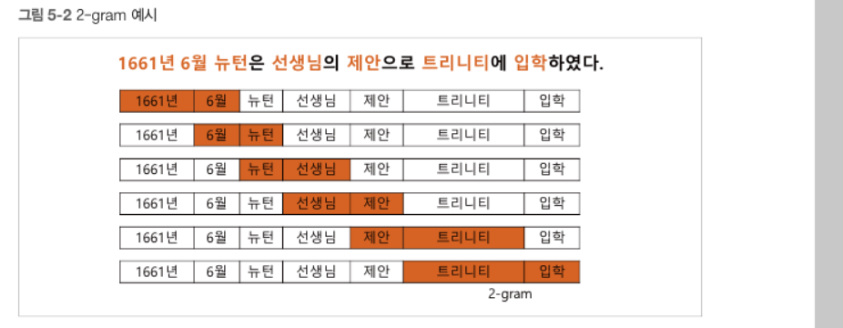

텍스트 유사도

두 개의 문장간의 유사도 구분

### n_gram 유사도

ngram  : 주어진 문장에서 n개의 연속적인 단워 나열을 의미

이웃한 단어의 출현 횟수를 통계적으로 표현해 텍스트의 유사도를 계산

    

 

A의 2 단어 행렬과 일치하는지 확인하면 A는 6개 전부

B는 4개만 일치 : 66% 일치

    

### 코사인 유사도

- 벡터 간 거리를 구해서 하는 방법

- 코사인은 -1~1 사이 값

- 벡터의 방향이 동일하면 1   (유사하다)

- 반대 방향이면 -1

- 직각이면 0

코사인 유사도 수식의 분자(두 벡터의 내적)

코사인 유사도 수식의 분모(두 벡터의 크기의 곱)

5/6 = 0.83333 : 83% 유사도

    

ngram에 비해서 유사도가 더 정확하게 나온다
