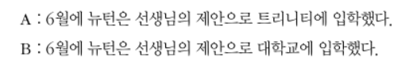
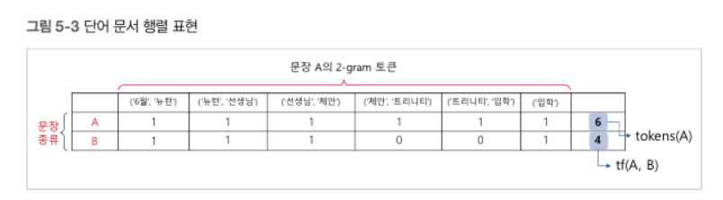
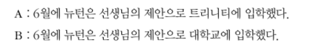
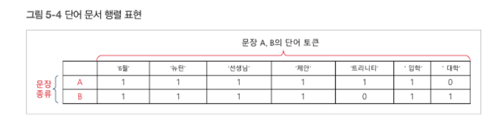
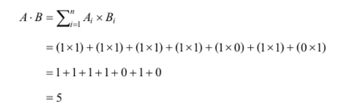
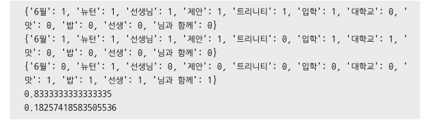

## 텍스트 유사도

- 두 개의 문장간의 유사도 구분

- n-gram / 코사인

### n_gram 유사도

ngram  : 주어진 문장에서 n개의 연속적인 단어 나열을 의미

이웃한 단어의 출현 횟수를 통계적으로 표현해 텍스트의 유사도를 계산

 



B는 4개만 일치
유사도 = B 일치 수/A 토큰 수

```py
from konlpy.tag import Komoran


# 어절 단위 n-gram
def word_ngram(bow, num_gram):
    text = tuple(bow)
    ngrams = [text[x:x + num_gram] for x in range(0, len(text))]
    return tuple(ngrams)
# 어절 단위로 잘라서 튜플로 반환
# num-gram이 토큰의 단위


# 음절 n-gram 분석
def phoneme_ngram(bow, num_gram):
    sentence = ' '.join(bow)
    text = tuple(sentence)
    slen = len(text)
    ngrams = [text[x:x + num_gram] for x in range(0, slen)]
    return ngrams


# 유사도 계산
def similarity(doc1, doc2):
    cnt = 0
    for token in doc1:
        if token in doc2:
            cnt = cnt + 1

    return cnt/len(doc1)
# 1의 토큰과 2의 토큰이 얼마나 유사한지 카운트, 1에 가까우면 유사한 것


# 문장 정의
sentence1 = '6월에 뉴턴은 선생님의 제안으로 트리니티에 입학하였다'
sentence2 = '6월에 뉴턴은 선생님의 제안으로 대학교에 입학하였다'
sentence3 = '나는 맛잇는 밥을 뉴턴 선생님과 함께 먹었습니다.'

komoran = Komoran()
bow1 = komoran.nouns(sentence1)
bow2 = komoran.nouns(sentence2)
bow3 = komoran.nouns(sentence3)
# 형태소 분석기를 통해 문장에서 명사를 리스트로 추출


doc1 = word_ngram(bow1, 2)
doc2 = word_ngram(bow2, 2)
doc3 = word_ngram(bow3, 2)
# 명사 리스트의 n_gram 토큰을 추출 (2단어씩 한 토큰)


print(doc1)
print(doc2)
print(doc3)

r1 = similarity(doc1, doc2)
# 1과 2의 유사도
r2 = similarity(doc3, doc1)
# 2와 3의 유사도
print(r1)
print(r2)

''' 
(('6월', '뉴턴'), ('뉴턴', '선생님'), ('선생님', '제안'), ('제안', '트리니티'), ('트리니티', '입학
'), ('입학',))
(('6월', '뉴턴'), ('뉴턴', '선생님'), ('선생님', '제안'), ('제안', '대학교'), ('대학교', '입학'), 
('입학',))
(('맛', '밥'), ('밥', '뉴턴'), ('뉴턴', '선생'), ('선생', '님과 함께'), ('님과 함께',))
0.6666666666666666
0.0
'''


'''
일부분씩만 비교하기 때문에 전체 문장을 비교하는 것보다 정확도가 떨어짐
n을 크게 잡으면 카운트를 놓칠 확률 커짐
n을 작게 잡으면 문맥을 파악하는 정확도 떨어짐
'''

'''


'''
n을 크게 잡으면 카운트를 놓칠 확률 커짐
n을 작게 잡으면 문맥을 파악하는 정확도 떨어짐
'''

```


### 코사인 유사도

- 벡터 간 거리를 구해서 하는 방법

- 코사인은 -1~1 사이 값

- 벡터의 방향이 동일하면 1   (유사하다)

- 반대 방향이면 -1

- 직각이면 0





- 두 문장의 벡터

A = [1,1,1,1,1,1,0]

B = [1,1,1,1,0,1,1]


코사인 유사도 수식의 분자(두 벡터의 내적)



코사인 유사도 수식의 분모(두 벡터의 크기의 곱)


5/6 = 0.83333 : 83% 유사도

    

ngram에 비해서 유사도가 더 정확하게 나온다

```py
# 코사인 유사도

from konlpy.tag import Komoran
import numpy as np
from numpy import dot
from numpy.linalg import norm


# 코사인 유사도 계산
def cos_sim(vec1, vec2):
    return dot(vec1, vec2) / (norm(vec1) * norm(vec2))
# 코사인 유사도 계산하는 함수
# norm : 벡터 크기 계산
# dot : 벡터 내적 계산


# TDM 만들기
def make_term_doc_mat(sentence_bow, word_dics):
    freq_mat = {}

    for word in word_dics:
        freq_mat[word] = 0

    for word in word_dics:
        if word in sentence_bow:
            freq_mat[word] += 1

    return freq_mat
# 문장에서 추출한 단어 사전을 기준으로 문장에 해당 단어들이 얼마나
# 포함되어 있는지 나타내는 단어 문서 행렬 함수


# 단어 벡터 만들기
def make_vector(tdm):
    vec = []
    for key in tdm:
        vec.append(tdm[key])
    return vec
# 단어 문서 행렬에서 토큰들의 출현 빈도 데이터를 벡터로 만들어주는 함수


# 문장 정의
sentence1 = '6월에 뉴턴은 선생님의 제안으로 트리니티에 입학하였다'
sentence2 = '6월에 뉴턴은 선생님의 제안으로 대학교에 입학하였다'
sentence3 = '나는 맛잇는 밥을 뉴턴 선생님과 함께 먹었습니다.'


# 헝태소분석기를 이용해 단어 묶음 리스트 생성
komoran = Komoran()
bow1 = komoran.nouns(sentence1)
bow2 = komoran.nouns(sentence2)
bow3 = komoran.nouns(sentence3)

# 단어 묶음 리스트를 하나로 합침
bow = bow1 + bow2 + bow3


# 단어 묶음에서 중복제거해 단어 사전 구축
word_dics = []
for token in bow:
    if token not in word_dics:
        word_dics.append(token)
# 중복된 단어를 제거해 새로운 단어 사전 구축


# 문장 별 단어 문서 행렬 계산
freq_list1 = make_term_doc_mat(bow1, word_dics)
freq_list2 = make_term_doc_mat(bow2, word_dics)
freq_list3 = make_term_doc_mat(bow3, word_dics)
print(freq_list1)
print(freq_list2)
print(freq_list3)
# 각 문장마다 단어 문서 행렬을 만든다


# 코사인 유사도 계산
doc1 = np.array(make_vector(freq_list1))
# 각 문장마다 벡터를 생성해 넘파이 배열로 변환
doc2 = np.array(make_vector(freq_list2))
doc3 = np.array(make_vector(freq_list3))
# 유사도 계산
r1 = cos_sim(doc1, doc2)
r2 = cos_sim(doc3, doc1)
print(r1)
print(r2)

```



