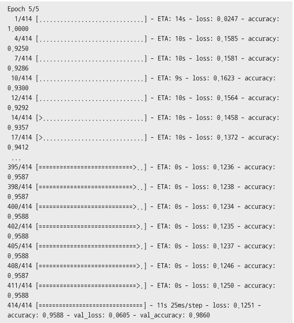

### 케라스

- 여러 딥러닝 프레임워크 중 하나
- 직관적이고 사용하기 쉽다
- 신경망 모델을 구축할 수 있는 고수준 API라이브러리
- 텐서플로 2.0에 기본 API로 채택

#### 인공신경망

- 두뇌의 신경세포인 뉴런을 수학적으로 모방한 모델
- 인공 신경망에 들어온 입력값이 임계치를 넘어 활성화되면 다음 뉴런으로 출력값을 내보냄


- 뉴런 1개에 입력값은 임의 설정 갯수, 출력값은 1개
  
  - 출력값을 늘리려면 뉴런 수 늘리기

- 입력값 x0, x1, x2 > 가중치 w0, w1, w2 , 편향값 b
  y = (w0x0 + w1x1 + w2x2) + b

#### 활성화 함수

- 입력된 신호가 특정한 강도 이상일 때만 다음 뉴런으로 신호 전달
- 3가지

##### 스텝 함수

- 입력값이 0보다 크면 1로, 0이하일 때는 0으로 만든다
- 즉, 입력값이 양수일 때만 활성화
- 결과값 : 0 또는 1 > 합.불 / T.F 등 이진 분류일 때 사용


- 결과를 너무 극단적으로 나누기 때문에 실제로 사용하기엔 문제가 있다.
- 0.1의 경우 0에 가깝지만 무조건 1로 출력

##### 시그모이드 함수

- 스텝함수에서 판단 기준이 되는 임계치 부근의 데이터를 고려하기 위해
  완만한 형태로 표현


- 0에서 1까지의 출력값이 확률로 표현
- 합격일 확률, 거짓일 확률
- 입력값이 0.2면 0.54 확률
- 시그모이드 입력값이 커질수록 미분값이 0으로 수렴하게 되는 단점
  - 가중치와 편향을 조정하는 도구가 미분 > 학습이 잘 안된다
- 분모에 exp함수를 사용 > 연산 비용이 크다

##### ReLU 함수

- 가장 많이 사용
- 연산비용이 작고, 학습이 빠르다


- 입력값이 0 이상이면 기울기 1인 직선

- 입력값 0보다 작으면 결과값 0

- 연산 비용이 크지 않아 학습속도가 빠르다

    


- 심층 신경망 : 입력층, 은닉층, 출력층으로 구성


- 뉴런과 은닉층을 늘리면 성능이 좋아지지만 학습비용이 올라간다

- 신경망의 순전파
  입력층으로부터 출력층까지 데이터가 순반향 전파
  현 단계 뉴런의 가중치와 전 단계 뉴런의 출력값의 곱을 입력값으로 받음
  이 값은 다시 활성화 함수를 통해 뉴런으로 전파


- 신경망의 역전파
  실제값과 비교해 오차가 많이 발생한 경우
  오차가 줄어드는 방향으로 가중치를 역방향으로 갱신해나감


- 딥러닝에서 학습이란 역잔파를 이용해 가중치를 조정해 나가는 과정

```py
# MNIST 예제
# 손글씨 0~9 이미지를딥러닝해 분류하는 것

import tensorflow as tf
import matplotlib.pyplot as plt
from tensorflow.keras.datasets import mnist
from tensorflow.keras.models import Sequential
from tensorflow.keras.layers import Flatten, Dense

# MNIST 데이터셋 가져오기
(x_train, y_train), (x_test, y_test) = mnist.load_data()
x_train, x_test = x_train / 255.0, x_test / 255.0  # 데이터 정규화
# 학습데이터 train과 테스트 데이터 test를 다운로드 한 후 저장
# xtrain에는 숫자 이미지 > ytrain에 실제 숫자값
# 255픽셀 값의 범위를 나누어 0~1 사이의 실숫값으로 정규화


# tf.data를 사용하여 데이터셋을 섞고 배치 만들기
ds = tf.data.Dataset.from_tensor_slices((x_train, y_train)).shuffle(10000)
train_size = int(len(x_train) * 0.7)  # 학습셋:검증셋 = 7:3
train_ds = ds.take(train_size).batch(20)
val_ds = ds.skip(train_size).batch(20)
# 학습셋과 검증셋을 일정 비율로 나누어 텐서플로 데이터셋 생성
# 학습하고 학습이 제대로 이루어지는 지 검증
# 배치 사이즈는 전체 학습 데이터셋보다 작거나 동일해야한다


# MNIST 분류 모델 구성
model = Sequential()
model.add(Flatten(input_shape=(28, 28)))
model.add(Dense(20, activation='relu'))
model.add(Dense(20, activation='relu'))
model.add(Dense(10, activation='softmax'))
# 순차 모델 : 신경망을 구성하는 기본적 방법
# > 복잡한 모델을 구성하기 위해서는 함수형 모델
# Flatten : 신경망의 입력층 : 2차원 이미지를 1차원으로 평탄화
# Dense : 2개의 은닉층 : 활성화 함수 ReLU 사용
#   # 가중치와 출력값의 개수를 조정해주는 함수
# 출력층 : 활성화함수 Softmax 사용
#   # 입력받은 값을 0~1 사이의 값으로 정규화
#   # 분류하고 싶은 클래스 10개 중 가장 큰 값을 가지는 것을 결과값
# 출력값의 총합이 1이 되므로 결과를 확률로 표현할 수 있음
# 가장 큰 출력값을 가지는 클래스가 결과값 > 9
# 입력층을 제외한 나머지 층에서는 입력 크기를 지정하지 않았다. 이전 층의 출력 개수로 입력 크기를 자동 계산


# 모델 생성
model.compile(loss='sparse_categorical_crossentropy',
              optimizer='sgd', metrics=['accuracy'])
# model.compile(loss='categorical_crossentropy', optimizer='sgd', metrics=['accuracy'])
# 정의한 신경망 모델을 실제 생성
# 오차 계산 손실 함수 : scc
#   # 손실함수 : 모델의 결과값과 실제 정답과의 오차를 계산하는 함수
# 오차 보정 옵티마이저 : SGD
# 성능평가 항목 : accuracy


# 모델 학습
hist = model.fit(train_ds, validation_data=val_ds, epochs=10)
# 앞에서 생성한 모델을 실제 학습
# 케라스의 fit 함수 사용 ( 학습데이터셋, 검증데이터셋, 에포크값)
# 에포크 : 학습 횟수 / 너무 크면 과적합(학습데이터에 너무 맞춰져서 실제 데이터에 오히려 성능이 낮다)


# 모델 평가
print('모델 평가')
model.evaluate(x_test, y_test)
# 평가


# 모델 정보 출력
model.summary()
# 출력


# 모델 저장
model.save('mnist_model.h5')
# 저장


# 학습 결과 그래프 그리기
fig, loss_ax = plt.subplots()
acc_ax = loss_ax.twinx()
loss_ax.plot(hist.history['loss'], 'y', label='train loss')
loss_ax.plot(hist.history['val_loss'], 'r', label='val loss')
acc_ax.plot(hist.history['accuracy'], 'b', label='train acc')
acc_ax.plot(hist.history['val_accuracy'], 'g', label='val acc')
loss_ax.set_xlabel('epoch')
loss_ax.set_ylabel('loss')
acc_ax.set_ylabel('accuracy')
loss_ax.legend(loc='upper left')
acc_ax.legend(loc='lower left')
plt.show()


'''
Epoch 1/10
2100/2100 [==============================] - 4s 2ms/step - loss: 0.7383 - accuracy: 0.7891 - val_loss: 0.3681 - val_accuracy: 0.8943
Epoch 2/10
2100/2100 [==============================] - 3s 1ms/step - loss: 0.3488 - accuracy: 0.8989 - val_loss: 0.3086 - val_accuracy: 0.9097
Epoch 3/10
2100/2100 [==============================] - 3s 1ms/step - loss: 0.3019 - accuracy: 0.9127 - val_loss: 0.2689 - val_accuracy: 0.9213
Epoch 4/10
2100/2100 [==============================] - 3s 1ms/step - loss: 0.2688 - accuracy: 0.9223 - val_loss: 0.2577 - val_accuracy: 0.9242
Epoch 5/10
2100/2100 [==============================] - 3s 1ms/step - loss: 0.2417 - accuracy: 0.9297 - val_loss: 0.2198 - val_accuracy: 0.9371
Epoch 6/10
2100/2100 [==============================] - 3s 1ms/step - loss: 0.2264 - accuracy: 0.9347 - val_loss: 0.2139 - val_accuracy: 0.9391
Epoch 7/10
2100/2100 [==============================] - 3s 1ms/step - loss: 0.2101 - accuracy: 0.9384 - val_loss: 0.2164 - val_accuracy: 0.9362
Epoch 8/10
2100/2100 [==============================] - 3s 1ms/step - loss: 0.1963 - accuracy: 0.9422 - val_loss: 0.1919 - val_accuracy: 0.9438
Epoch 9/10
2100/2100 [==============================] - 3s 1ms/step - loss: 0.1847 - accuracy: 0.9455 - val_loss: 0.2108 - val_accuracy: 0.9383
Epoch 10/10
2100/2100 [==============================] - 3s 2ms/step - loss: 0.1764 - accuracy: 0.9480 - val_loss: 0.1744 - val_accuracy: 0.9482
모델 평가
313/313 [==============================] - 0s 837us/step - loss: 0.1794 - accuracy: 0.9471
Model: "sequential"
_________________________________________________________________
 Layer (type)                Output Shape              Param #
=================================================================
 flatten (Flatten)           (None, 784)               0

 dense (Dense)               (None, 20)                15700

 dense_1 (Dense)             (None, 20)                420

 dense_2 (Dense)             (None, 10)                210

=================================================================
Total params: 16,330
Trainable params: 16,330
Non-trainable params: 0
_________________________________________________________________
'''
```


- 학습횟수가 증가할수록 정확도 증가, 손실값 감소



