### 케라스

- 여러 딥러닝 프레임워크 중 하나
- 직관적이고 사용하기 쉽다
- 신경망 모델을 구축할 수 있는 고수준 API라이브러리
- 텐서플로 2.0에 기본 API로 채택

#### 인공신경망

- 두뇌의 신경세포인 뉴런을 수학적으로 모방한 모델
- 인공 신경망에 들어온 입력값이 임계치를 넘어 활성화되면 다음 뉴런으로 출력값을 내보냄

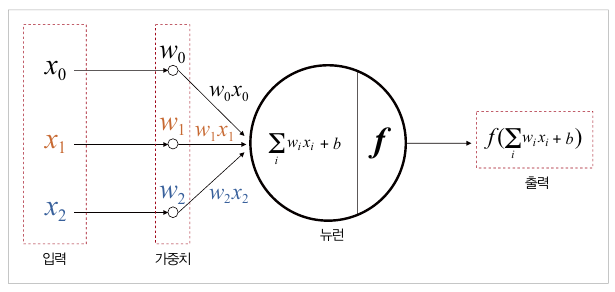

- 뉴런 1개에 입력값은 임의 설정 갯수, 출력값은 1개
  
  - 출력값을 늘리려면 뉴런 수 늘리기

- 입력값 x0, x1, x2 > 가중치 w0, w1, w2 , 편향값 b
  y = (w0x0 + w1x1 + w2x2) + b

#### 활성화 함수

- 입력된 신호가 특정한 강도 이상일 때만 다음 뉴런으로 신호 전달
- 3가지

##### 스텝 함수

- 입력값이 0보다 크면 1로, 0이하일 때는 0으로 만든다
- 즉, 입력값이 양수일 때만 활성화
- 결과값 : 0 또는 1 > 합.불 / T.F 등 이진 분류일 때 사용

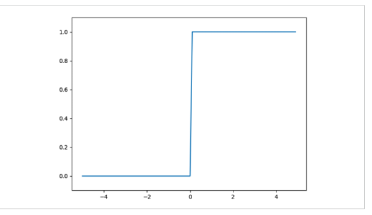

- 결과를 너무 극단적으로 나누기 때문에 실제로 사용하기엔 문제가 있다.
- 0.1의 경우 0에 가깝지만 무조건 1로 출력

##### 시그모이드 함수

- 스텝함수에서 판단 기준이 되는 임계치 부근의 데이터를 고려하기 위해
  완만한 형태로 표현

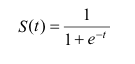

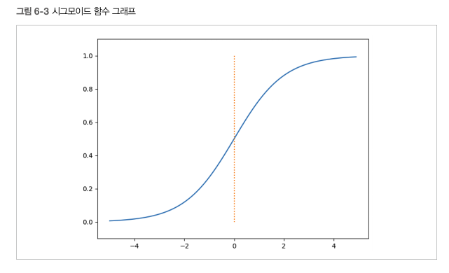

- 0에서 1까지의 출력값이 확률로 표현
- 합격일 확률, 거짓일 확률
- 입력값이 0.2면 0.54 확률
- 시그모이드 입력값이 커질수록 미분값이 0으로 수렴하게 되는 단점
  - 가중치와 편향을 조정하는 도구가 미분 > 학습이 잘 안된다
- 분모에 exp함수를 사용 > 연산 비용이 크다

##### ReLU 함수

- 가장 많이 사용
- 연산비용이 작고, 학습이 빠르다

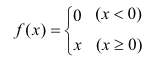

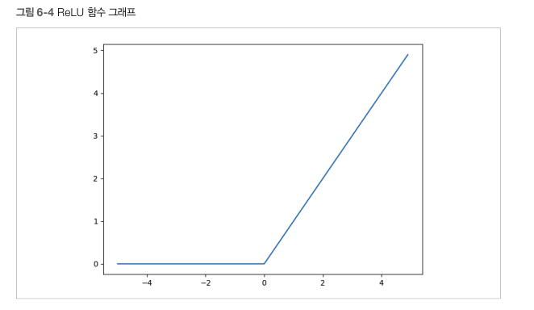

- 입력값이 0 이상이면 기울기 1인 직선

- 입력값 0보다 작으면 결과값 0

- 연산 비용이 크지 않아 학습속도가 빠르다

    

- 심층 신경망 : 입력층, 은닉층, 출력층으로 구성

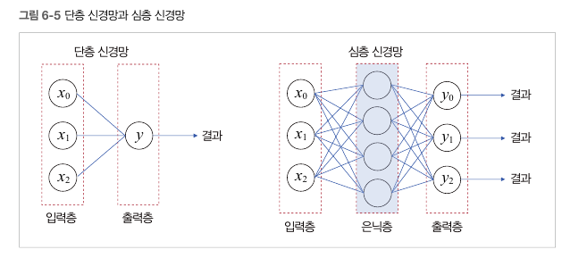

- 뉴런과 은닉층을 늘리면 성능이 좋아지지만 학습비용이 올라간다

- 신경망의 순전파
  입력층으로부터 출력층까지 데이터가 순반향 전파
  현 단계 뉴런의 가중치와 전 단계 뉴런의 출력값의 곱을 입력값으로 받음
  이 값은 다시 활성화 함수를 통해 뉴런으로 전파


- 신경망의 역전파
  실제값과 비교해 오차가 많이 발생한 경우
  오차가 줄어드는 방향으로 가중치를 역방향으로 갱신해나감

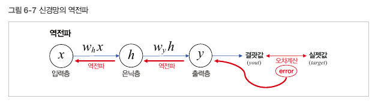

- 딥러닝에서 학습이란 역잔파를 이용해 가중치를 조정해 나가는 과정

```py
# MNIST 예제
# 손글씨 0~9 이미지를딥러닝해 분류하는 것

import tensorflow as tf
import matplotlib.pyplot as plt
from tensorflow.keras.datasets import mnist
from tensorflow.keras.models import Sequential
from tensorflow.keras.layers import Flatten, Dense

# MNIST 데이터셋 가져오기
(x_train, y_train), (x_test, y_test) = mnist.load_data()
x_train, x_test = x_train / 255.0, x_test / 255.0  # 데이터 정규화
# 학습데이터 train과 테스트 데이터 test를 다운로드 한 후 저장
# xtrain에는 숫자 이미지 > ytrain에 실제 숫자값
# 255픽셀 값의 범위를 나누어 0~1 사이의 실숫값으로 정규화


# tf.data를 사용하여 데이터셋을 섞고 배치 만들기
ds = tf.data.Dataset.from_tensor_slices((x_train, y_train)).shuffle(10000)
train_size = int(len(x_train) * 0.7)  # 학습셋:검증셋 = 7:3
train_ds = ds.take(train_size).batch(20)
val_ds = ds.skip(train_size).batch(20)
# 학습셋과 검증셋을 일정 비율로 나누어 텐서플로 데이터셋 생성
# 학습하고 학습이 제대로 이루어지는 지 검증
# 배치 사이즈는 전체 학습 데이터셋보다 작거나 동일해야한다


# MNIST 분류 모델 구성
model = Sequential()
model.add(Flatten(input_shape=(28, 28)))
model.add(Dense(20, activation='relu'))
model.add(Dense(20, activation='relu'))
model.add(Dense(10, activation='softmax'))
# 순차 모델 : 신경망을 구성하는 기본적 방법
# > 복잡한 모델을 구성하기 위해서는 함수형 모델
# Flatten : 신경망의 입력층 : 2차원 이미지를 1차원으로 평탄화
# Dense : 2개의 은닉층 : 활성화 함수 ReLU 사용
#   # 가중치와 출력값의 개수를 조정해주는 함수
# 출력층 : 활성화함수 Softmax 사용
#   # 입력받은 값을 0~1 사이의 값으로 정규화
#   # 분류하고 싶은 클래스 10개 중 가장 큰 값을 가지는 것을 결과값
# 출력값의 총합이 1이 되므로 결과를 확률로 표현할 수 있음
# 가장 큰 출력값을 가지는 클래스가 결과값 > 9
# 입력층을 제외한 나머지 층에서는 입력 크기를 지정하지 않았다. 이전 층의 출력 개수로 입력 크기를 자동 계산


# 모델 생성
model.compile(loss='sparse_categorical_crossentropy',
              optimizer='sgd', metrics=['accuracy'])
# model.compile(loss='categorical_crossentropy', optimizer='sgd', metrics=['accuracy'])
# 정의한 신경망 모델을 실제 생성
# 오차 계산 손실 함수 : scc
#   # 손실함수 : 모델의 결과값과 실제 정답과의 오차를 계산하는 함수
# 오차 보정 옵티마이저 : SGD
# 성능평가 항목 : accuracy


# 모델 학습
hist = model.fit(train_ds, validation_data=val_ds, epochs=10)
# 앞에서 생성한 모델을 실제 학습
# 케라스의 fit 함수 사용 ( 학습데이터셋, 검증데이터셋, 에포크값)
# 에포크 : 학습 횟수 / 너무 크면 과적합(학습데이터에 너무 맞춰져서 실제 데이터에 오히려 성능이 낮다)


# 모델 평가
print('모델 평가')
model.evaluate(x_test, y_test)
# 평가


# 모델 정보 출력
model.summary()
# 출력


# 모델 저장
model.save('mnist_model.h5')
# 저장


# 학습 결과 그래프 그리기
fig, loss_ax = plt.subplots()
acc_ax = loss_ax.twinx()
loss_ax.plot(hist.history['loss'], 'y', label='train loss')
loss_ax.plot(hist.history['val_loss'], 'r', label='val loss')
acc_ax.plot(hist.history['accuracy'], 'b', label='train acc')
acc_ax.plot(hist.history['val_accuracy'], 'g', label='val acc')
loss_ax.set_xlabel('epoch')
loss_ax.set_ylabel('loss')
acc_ax.set_ylabel('accuracy')
loss_ax.legend(loc='upper left')
acc_ax.legend(loc='lower left')
plt.show()


'''
Epoch 1/10
2100/2100 [==============================] - 4s 2ms/step - loss: 0.7383 - accuracy: 0.7891 - val_loss: 0.3681 - val_accuracy: 0.8943
Epoch 2/10
2100/2100 [==============================] - 3s 1ms/step - loss: 0.3488 - accuracy: 0.8989 - val_loss: 0.3086 - val_accuracy: 0.9097
Epoch 3/10
2100/2100 [==============================] - 3s 1ms/step - loss: 0.3019 - accuracy: 0.9127 - val_loss: 0.2689 - val_accuracy: 0.9213
Epoch 4/10
2100/2100 [==============================] - 3s 1ms/step - loss: 0.2688 - accuracy: 0.9223 - val_loss: 0.2577 - val_accuracy: 0.9242
Epoch 5/10
2100/2100 [==============================] - 3s 1ms/step - loss: 0.2417 - accuracy: 0.9297 - val_loss: 0.2198 - val_accuracy: 0.9371
Epoch 6/10
2100/2100 [==============================] - 3s 1ms/step - loss: 0.2264 - accuracy: 0.9347 - val_loss: 0.2139 - val_accuracy: 0.9391
Epoch 7/10
2100/2100 [==============================] - 3s 1ms/step - loss: 0.2101 - accuracy: 0.9384 - val_loss: 0.2164 - val_accuracy: 0.9362
Epoch 8/10
2100/2100 [==============================] - 3s 1ms/step - loss: 0.1963 - accuracy: 0.9422 - val_loss: 0.1919 - val_accuracy: 0.9438
Epoch 9/10
2100/2100 [==============================] - 3s 1ms/step - loss: 0.1847 - accuracy: 0.9455 - val_loss: 0.2108 - val_accuracy: 0.9383
Epoch 10/10
2100/2100 [==============================] - 3s 2ms/step - loss: 0.1764 - accuracy: 0.9480 - val_loss: 0.1744 - val_accuracy: 0.9482
모델 평가
313/313 [==============================] - 0s 837us/step - loss: 0.1794 - accuracy: 0.9471
Model: "sequential"
_________________________________________________________________
 Layer (type)                Output Shape              Param #
=================================================================
 flatten (Flatten)           (None, 784)               0

 dense (Dense)               (None, 20)                15700

 dense_1 (Dense)             (None, 20)                420

 dense_2 (Dense)             (None, 10)                210

=================================================================
Total params: 16,330
Trainable params: 16,330
Non-trainable params: 0
_________________________________________________________________
'''
```

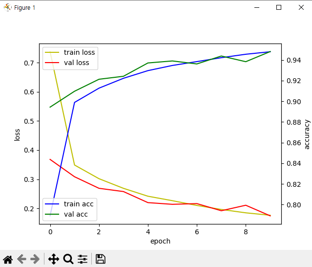

- 학습횟수가 증가할수록 정확도 증가, 손실값 감소

### 학습 모델 사용

```py
from tensorflow.keras.datasets import mnist
from tensorflow.keras.models import load_model
import matplotlib.pyplot as plt

# 학습된 딥러닝 모델 사용


# MNIST 데이터셋 가져오기
_, (x_test, y_test) = mnist.load_data()
x_test = x_test / 255.0  # 데이터 정규화
#


# 모델 불러오기
model = load_model('mnist_model.h5')
model.summary()
model.evaluate(x_test, y_test, verbose=2)
# 모델 불러오기
# 모델 정보 확인
# 모델 성능 평가


# 테스트셋에서 20번째 이미지 출력
plt.imshow(x_test[20], cmap="gray")
plt.show()
# imshow 함수를 통해 20번쨰 숫자 이미지를 흑백으로 출력


# 테스트셋의 20번째 이미지 클래스 분류
picks = [20]
y_prob = model.predict(x_test[picks])
predict = y_prob.argmax(axis=-1)
# predict = model.predict_classes(x_test[picks])
print("손글씨 이미지 예측값 : ", predict)
# predict_classes는 입력 데이터에 대해 클래스를 예측한 값을 반환합니다
# 20번째 테스트셋의 숫자 이미지가 어떤 클래스에 포함되어 있는지 판단


'''
Model: "sequential"
_________________________________________________________________
 Layer (type)                Output Shape              Param #   
=================================================================
 flatten (Flatten)           (None, 784)               0

 dense (Dense)               (None, 20)                15700     

 dense_1 (Dense)             (None, 20)                420       

 dense_2 (Dense)             (None, 10)                210       

=================================================================
Total params: 16,330
Trainable params: 16,330
Non-trainable params: 0
_________________________________________________________________
313/313 - 0s - loss: 0.1794 - accuracy: 0.9471 - 370ms/epoch - 1ms/step
1/1 [==============================] - 0s 60ms/step
손글씨 이미지 예측값 :  [9]
'''
```

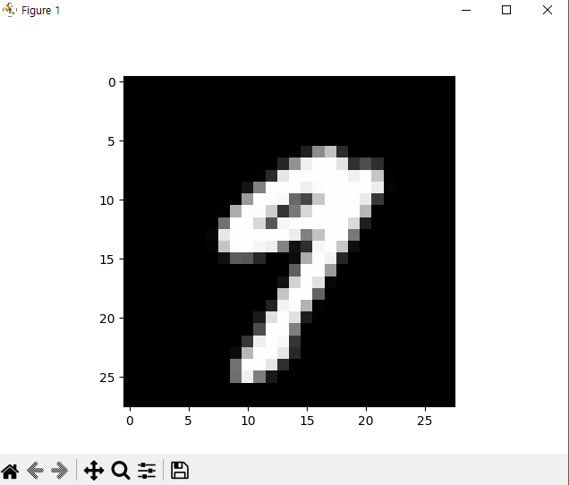

### CNN 모델

- 문장 의도 분류를 위해 사용하는 딥러닝 모델

#### 합성곱 신경망

1) 패딩 처리
- 데이터 손실 방지, 입력 데이터 크기 유지

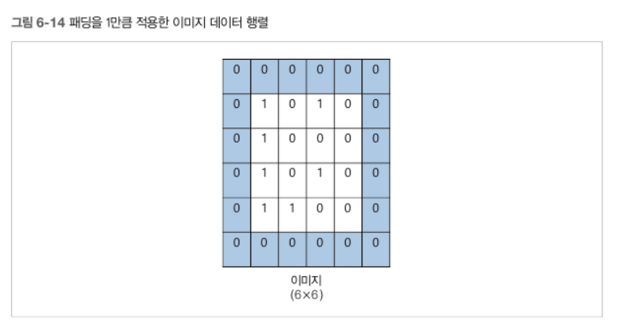

2. 합성곱 연산

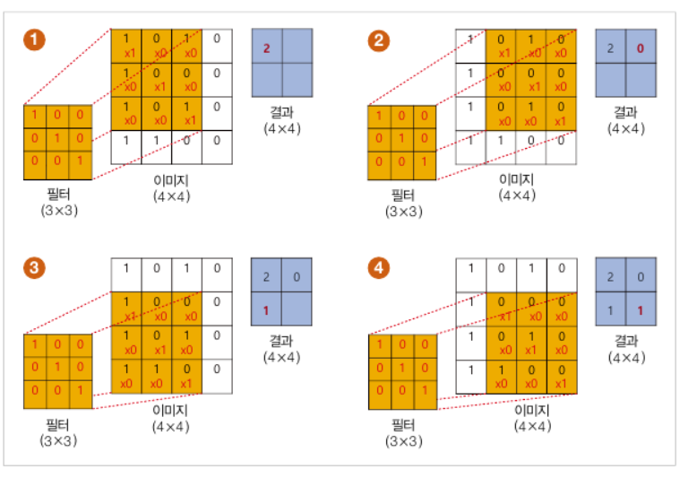

- N*N 사이즈의 필터를 일정 칸(스트라이드) 이동 하면서 필터에 설정한 가중치를 곱하고 더해줘서 연산

- 더 이상 이동할 수 없을 때까지 연산하고 나온 결과가 특징맵
3) 풀링연산
- 합성곱 연산의 결과로 나온 특징맵의 주요한 특징을 추출하기 위해 사용하는 연산

- 최대풀링, 평균풀링 등

- 윈도우 크기 내부에서 최대값 추출

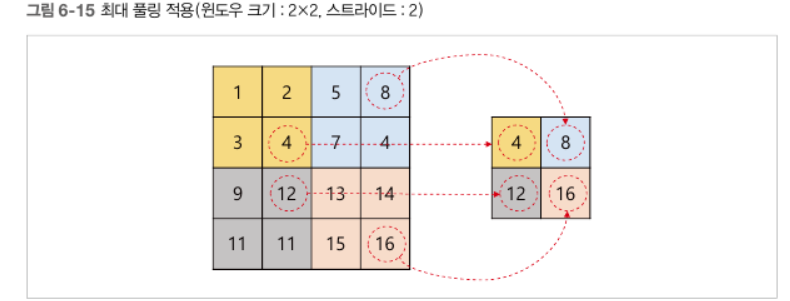

### CNN을 이용한 감정분류모델

```py
# CNN : 합성곱 신경망
# 합성곱 : 특정 크기의 행렬(필터)을 이미지 데이터 행렬에 슬라이딩하면서
# 곱하고 더하는 연산을 의미합니다
# 필터 영역에 설정된 만큼 곱하고 더하기
# 필터가 더 이상 이동할 수 없을 때까지 반복 > 최종 결과 = 특징맵
# 풀링 : 합성곱 연산 결과로 나온 특징맵의 크기를 줄이거나
# 주요한 특징을 추출하기 위해 사용하는 연산
# 최대 풀링 각 영역의 최대값들을 추출

# 감정분류 모델


# 필요한 모듈 임포트
import pandas as pd
import tensorflow as tf
from tensorflow.keras import preprocessing
from tensorflow.keras.models import Model
from tensorflow.keras.layers import Input, Embedding, Dense, Dropout, Conv1D, GlobalMaxPool1D, concatenate

# 데이터 읽어오기
train_file = "./chatbotdata.csv"
data = pd.read_csv(train_file, delimiter=',')
features = data['Q'].tolist()
labels = data['label'].tolist()
# csv 파일 읽어오기
# Q 질문 데이터를 featuers에
# label 감정 데이터를 lavels에 저장


# 단어 인덱스 시퀀스 벡터
corpus = [preprocessing.text.text_to_word_sequence(text) for text in features]

tokenizer = preprocessing.text.Tokenizer()
tokenizer.fit_on_texts(corpus)
sequences = tokenizer.texts_to_sequences(corpus)
word_index = tokenizer.word_index
MAX_SEQ_LEN = 15  # 단어 시퀀스 벡터 크기
padded_seqs = preprocessing.sequence.pad_sequences(
    sequences, maxlen=MAX_SEQ_LEN, padding='post')
# 질문 리스트에서 문장을 하나씩 꺼내와 text_to_word_sequence 함수를 통해
# 단어 시퀀스를 만듭니다 : 단어 토큰들의 순차적 리스트
# 단어 시퀀스를 말뭉치 리스트에 저장
# texts_to_sequences 함수를 통해 문장 내 모든 단어를 시퀀스 번호로 변환
# 시퀀스 번호를 통해 단어 임베딩 벡터 만든다
# > 문장의 길이가 제각각이므로 벡터 크기도 제각각
# MAX_SEQ_LEN 만큼 설정하고 남은 영역을 0으로 패딩


# 학습용, 검증용, 테스트용 데이터셋 생성 ➌
# 학습셋:검증셋:테스트셋 = 7:2:1
ds = tf.data.Dataset.from_tensor_slices((padded_seqs, labels))
ds = ds.shuffle(len(features))
train_size = int(len(padded_seqs) * 0.7)
val_size = int(len(padded_seqs) * 0.2)
test_size = int(len(padded_seqs) * 0.1)
train_ds = ds.take(train_size).batch(20)
val_ds = ds.skip(train_size).take(val_size).batch(20)
test_ds = ds.skip(train_size + val_size).take(test_size).batch(20)
# 데이터셋 객체로 학습용, 검증용, 테스트용 7:2:1로 나눈다

# 하이퍼파라미터 설정
dropout_prob = 0.5
EMB_SIZE = 128
EPOCH = 5
VOCAB_SIZE = len(word_index) + 1  # 전체 단어 수


# CNN 모델 정의
input_layer = Input(shape=(MAX_SEQ_LEN,))
# 임베딩 계층
embedding_layer = Embedding(
    VOCAB_SIZE, EMB_SIZE, input_length=MAX_SEQ_LEN)(input_layer)
# 과적합 방지
dropout_emb = Dropout(rate=dropout_prob)(embedding_layer)

# 합성곱 필터로 특징추출해서 분류    # 합성곱 필터의 매개변수가 여태까지의 가중치에 해당한다.    역전파 같이 가중치를 계산해줄 수 있다
# 스트라이드 : 상하좌우 이동 칸 수
# 합성곱 필터 : 가중치 계산해줄 필터 / 패딩 : 특징맵의 크기가 작아지면서 데이터 유실, 혹은 입력 데이터보다 작아지는 것을 막을 수 있음
conv1 = Conv1D(filters=128, kernel_size=3, padding='valid',
               activation=tf.nn.relu)(dropout_emb)

# 최대풀링해주는 함수
pool1 = GlobalMaxPool1D()(conv1)

conv2 = Conv1D(filters=128, kernel_size=4, padding='valid',
               activation=tf.nn.relu)(dropout_emb)
pool2 = GlobalMaxPool1D()(conv2)
conv3 = Conv1D(filters=128, kernel_size=5, padding='valid',
               activation=tf.nn.relu)(dropout_emb)
pool3 = GlobalMaxPool1D()(conv3)
# cnn 모델을 케라스 함수형 모델로 구현
# 임베딩 > 합성곱필터 > 평탄화 > 감정별로 분류


# 3, 4, 5- gram 이후 합치기
concat = concatenate([pool1, pool2, pool3])
# 완전 연결 계층 구현
# 3개의 특징맵 데이터를 dense에 받아서 3개의 점수가 출력
hidden = Dense(128, activation=tf.nn.relu)(concat)
dropout_hidden = Dropout(rate=dropout_prob)(hidden)
logits = Dense(3, name='logits')(dropout_hidden)
# 점수를 소프트맥스 계층을 통해 감정 클래스별 확률을 계산
predictions = Dense(3, activation=tf.nn.softmax)(logits)


# 모델 생성
model = Model(inputs=input_layer, outputs=predictions)
model.compile(optimizer='adam',
              loss='sparse_categorical_crossentropy', metrics=['accuracy'])
# 정의한 계층들을 모델에 추가, 컴파일


# 모델 학습
model.fit(train_ds, validation_data=val_ds, epochs=EPOCH, verbose=1)
# 정의한 모델을 학습


# 모델 평가(테스트 데이터셋 이용)
loss, accuracy = model.evaluate(test_ds, verbose=1)
print('Accuracy: %f' % (accuracy * 100))
print('loss: %f' % (loss))
# 성능 평가


# 모델 저장
model.save('cnn_model.h5')
# 저장


'''
Epoch 1/5
414/414 [==============================] - 7s 16ms/step - loss: 0.9257 - accuracy: 0.5411 - val_loss: 0.5434 - val_accuracy: 0.8088
Epoch 2/5
414/414 [==============================] - 7s 16ms/step - loss: 0.5273 - accuracy: 0.8003 - val_loss: 0.2929 - val_accuracy: 0.9095
Epoch 3/5
414/414 [==============================] - 7s 16ms/step - loss: 0.3258 - accuracy: 0.8933 - val_loss: 0.1675 - val_accuracy: 0.9497
Epoch 4/5
414/414 [==============================] - 7s 16ms/step - loss: 0.2123 - accuracy: 0.9339 - val_loss: 0.1024 - val_accuracy: 0.9704
Epoch 5/5
414/414 [==============================] - 7s 16ms/step - loss: 0.1398 - accuracy: 0.9581 - val_loss: 0.0762 - val_accuracy: 0.9776
60/60 [==============================] - 0s 2ms/step - loss: 0.0626 - accuracy: 0.9788
Accuracy: 97.884941
loss: 0.062563


# 에포크가 진행될수록 loss가 줄고, accuracy는 증가한다
'''
```

### 감정분류 모델 사용

```py
import tensorflow as tf
import pandas as pd
from tensorflow.keras.models import Model, load_model
from tensorflow.keras import preprocessing

# 데이터 읽어오기
train_file = "./chatbotdata.csv"
data = pd.read_csv(train_file, delimiter=',')
features = data['Q'].tolist()
labels = data['label'].tolist()
# csv 파일에서 질문 데이터와 감정 데이터를 불러옴


# 단어 인덱스 시퀀스 벡터
corpus = [preprocessing.text.text_to_word_sequence(text) for text in features]
tokenizer = preprocessing.text.Tokenizer()
tokenizer.fit_on_texts(corpus)
sequences = tokenizer.texts_to_sequences(corpus)
MAX_SEQ_LEN = 15  # 단어 시퀀스 벡터 크기
padded_seqs = preprocessing.sequence.pad_sequences(
    sequences, maxlen=MAX_SEQ_LEN, padding='post')
# 질문 리스트에서 문장을 하나씩 꺼내와 text_to_word_sequence 함수를 통해
# 단어 시퀀스를 만듭니다 : 단어 토큰들의 순차적 리스트
# 단어 시퀀스를 말뭉치 리스트에 저장
# texts_to_sequences 함수를 통해 문장 내 모든 단어를 시퀀스 번호로 변환
# 시퀀스 번호를 통해 단어 임베딩 벡터 만든다
# > 문장의 길이가 제각각이므로 벡터 크기도 제각각
# MAX_SEQ_LEN 만큼 설정하고 남은 영역을 0으로 패딩


# 테스트용 데이터셋 생성
ds = tf.data.Dataset.from_tensor_slices((padded_seqs, labels))
ds = ds.shuffle(len(features))
test_ds = ds.take(2000).batch(20)  # 테스트 데이터셋
# 데이터셋 객채로 변경하여 20개씩 배치 처리


# 감정 분류 CNN 모델 불러오기
model = load_model('cnn_model.h5')
model.summary()
model.evaluate(test_ds, verbose=2)
# 모델 파일을 불러와서 모델 객체를 반환
# 모델 정보 확인
# 성능 평가


# 테스트용 데이터셋의 10212번째 데이터 출력
print("단어 시퀀스 : ", corpus[10211])
print("단어 인덱스 시퀀스 : ", padded_seqs[10211])
print("문장 분류(정답) : ", labels[10211])
# 10212번째 문장의 감정을 예측


# 테스트용 데이터셋의 10212번째 데이터 감정 예측
picks = [10212]
predict = model.predict(padded_seqs[picks])
predict_class = tf.math.argmax(predict, axis=1)
print("감정 예측 점수 : ", predict)
print("감정 예측 클래스 : ", predict_class.numpy())
# 각 클래스별 예측 점수 반환

'''
__________________________________________________________________________________________________
 Layer (type)                   Output Shape         Param #     Connected to
==================================================================================================
 input_1 (InputLayer)           [(None, 15)]         0           []

 embedding (Embedding)          (None, 15, 128)      1715072     ['input_1[0][0]']

 dropout (Dropout)              (None, 15, 128)      0           ['embedding[0][0]']

 conv1d (Conv1D)                (None, 13, 128)      49280       ['dropout[0][0]']

 conv1d_1 (Conv1D)              (None, 12, 128)      65664       ['dropout[0][0]']

 conv1d_2 (Conv1D)              (None, 11, 128)      82048       ['dropout[0][0]']

 global_max_pooling1d (GlobalMa  (None, 128)         0           ['conv1d[0][0]']
 xPooling1D)

 global_max_pooling1d_1 (Global  (None, 128)         0           ['conv1d_1[0][0]']
 MaxPooling1D)

 global_max_pooling1d_2 (Global  (None, 128)         0           ['conv1d_2[0][0]']
 MaxPooling1D)

 concatenate (Concatenate)      (None, 384)          0           ['global_max_pooling1d[0][0]',
                                                                  'global_max_pooling1d_1[0][0]',
                                                                  'global_max_pooling1d_2[0][0]']

 dense (Dense)                  (None, 128)          49280       ['concatenate[0][0]']

 dropout_1 (Dropout)            (None, 128)          0           ['dense[0][0]']

 logits (Dense)                 (None, 3)            387         ['dropout_1[0][0]']

 dense_1 (Dense)                (None, 3)            12          ['logits[0][0]']

==================================================================================================
Total params: 1,961,743
Trainable params: 1,961,743
Non-trainable params: 0
__________________________________________________________________________________________________
100/100 - 0s - loss: 0.0691 - accuracy: 0.9775 - 313ms/epoch - 3ms/step
단어 시퀀스 :  ['썸', '타는', '여자가', '남사친', '만나러', '간다는데', '뭐라', '해']
단어 인덱스 시퀀스 :  [   13    61   127  4320  1333 12162   856    31     0     0     0     0
     0     0     0]
문장 분류(정답) :  2
1/1 [==============================] - 0s 94ms/step


감정 예측 점수 :  [[1.9792099e-06 4.0655623e-06 9.9999392e-01]]
감정 예측 클래스 :  [2]
'''
```
