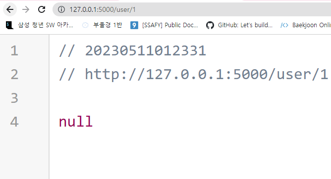
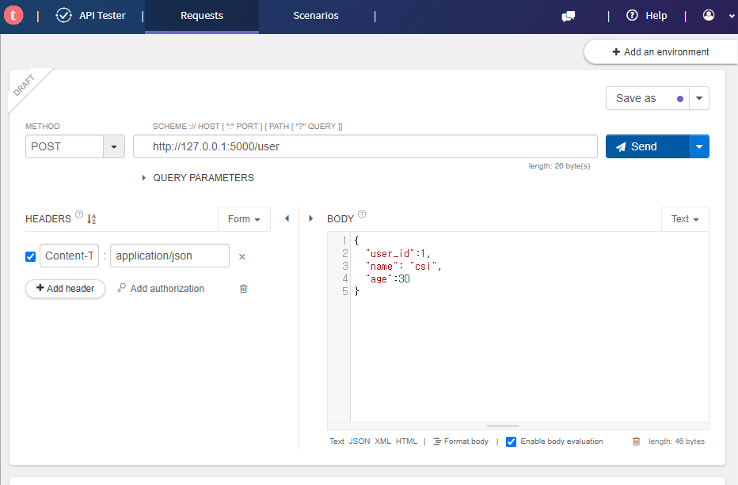
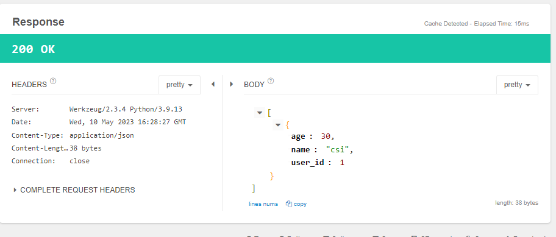
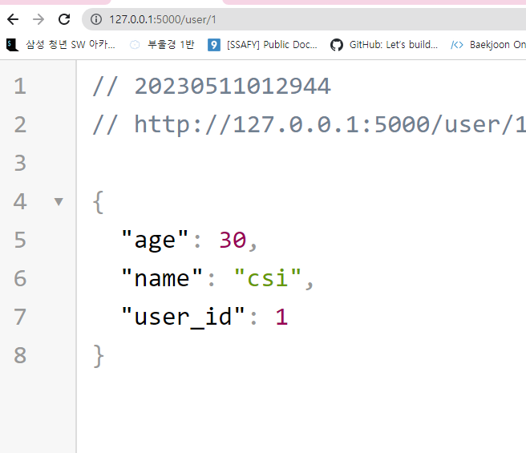
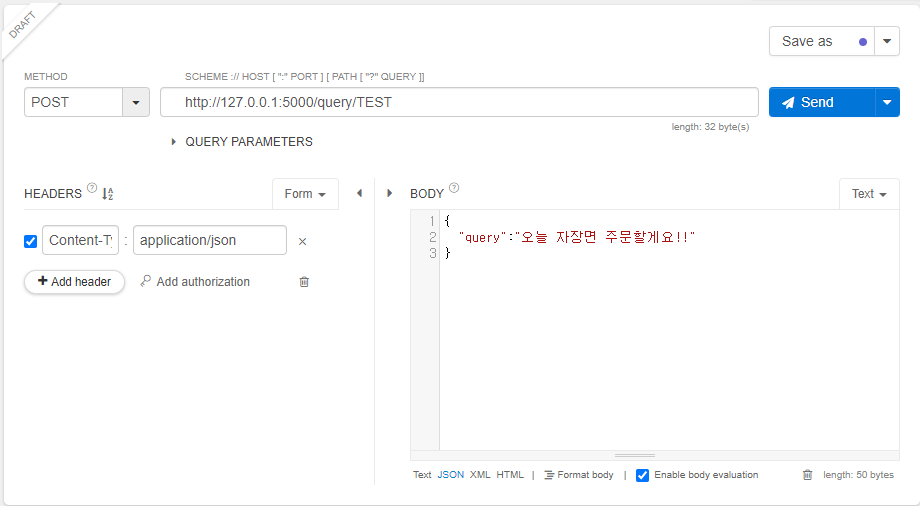
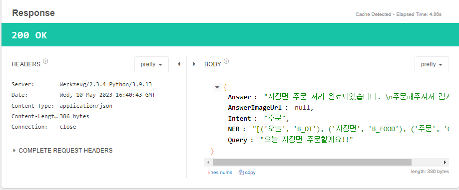

```py
from flask import Flask
app = Flask(__name__)

@app.route('/')
def hello():
    return 'Hello Flask'

if __name__ == '__main__':
    app.run()
```


    


```py
#  동적변수
from flask import Flask
app = Flask(__name__)

@app.route('/')
def hello():
    return 'Hello Flask'

# srting이 기본
@app.route('/info/<name>')
def get_name(name):
    return "hello {}".format(name)

# int면 int만
@app.route('/user/<int:id>')
def get_user(id):
    return "user id is {}".format(id)

# 하나의 view에 2개의 경로
@app.route('/json/<int:dest_id>/<message>')
@app.route('/JSON/<int:dest_id>/<message>')
def send_message(dest_id, message):
    json = {
    "bot_id": dest_id,
    "message": message
    }
    return json

if __name__ == '__main__':
    app.run()
```


    


```py
from flask import Flask, request, jsonify
app = Flask(__name__)

# 서버 리소스
resource = []

# 사용자 정보 조회
@app.route('/user/<int:user_id>', methods=['GET'])
def get_user(user_id):

    for user in resource:
        if user['user_id'] is user_id:
            return jsonify(user)

    return jsonify(None)


# 사용자 추가
@app.route('/user', methods=['POST'])
def add_user():
    user = request.get_json()
    resource.append(user)
    return jsonify(resource)


if __name__ == '__main__':
    app.run()
```










    




