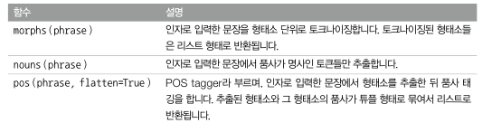
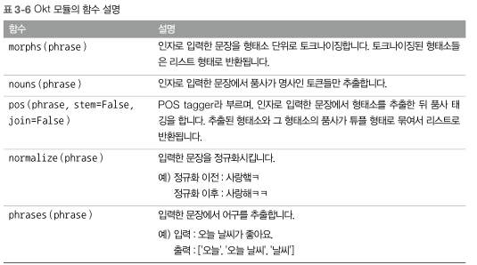
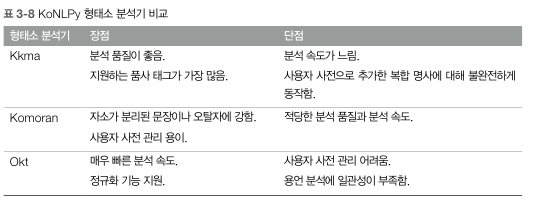
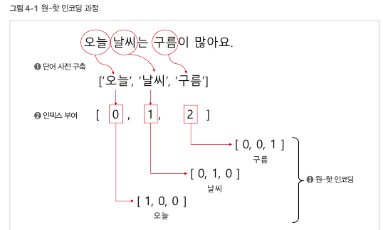
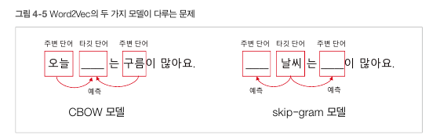
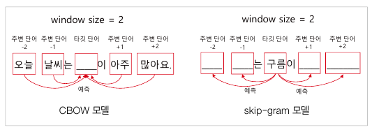

# 1) 토크나이징

- 자연어 : 우리가 일상에서 사용하는 언어

- 자연어 처리 : 자연어 의미를 분석해 컴퓨터가 처리할 수 있도록 하는 일

### 토크나이징

- 주어진 문장에서 토큰 단위로 정보를 나누는 작업

- 문장을 일정한 의미가 있는 가장 작은 단어들로 나눈다

- 나눠진 단어들을 이용해 의미를 분석한다 ( 토큰 : 가장 기본이 되는 단어들)

- 토큰의 기준은 일정한 의미를 가진 가장 작은 정보 단위(단어)

    

## 한국어 자연어 처리

### KoNLPY(코엔엘파이)

- 기본적인 한국어 자연어 처리를 위한 파이썬 라이브러리

- 형태소를 토큰 단위로 사용(언어학에서 일정한 의미가 있는 가장 작은 말의 단위)

    

### 형태소 분석기

- 한국어의 복잡한 특성(명사와 조사를 띄어쓰지 않고, 다양한 어미)에 따라 형태소를 분석할 수 있는 도구

- 형태소 뿐만 아니라 어근, 접두사, 품사 등 다양한 언어적 속성의 구조를 파악해줌

- 세가지 형태소 분석기

    

### Kkma

- 꼬꼬마

```py
from konlpy.tag import Kkma

kkma = Kkma()
text = "아버지가 방에 들어갑니다."

morphs = kkma.morphs(text)
print(morphs)

pos = kkma.pos(text)
print(pos)

nouns = kkma.nouns(text)
print(nouns)

sentences = "오늘 날씨는 어때요? 내일은 덥다던데."
s = kkma.sentences(sentences)
print(s)

['아버지', '가', '방', '에', '들어가', 'ㅂ니다', '.']
[('아버지', 'NNG'), ('가', 'JKS'), ('방', 'NNG'), ('에', 'JKM'), ('들어가', 'VV'), ('ㅂ니다', 'EFN'), ('.', 'SF')]
['아버지', '방']
['오늘 날씨는 어 때요?', '내일은 덥다 던데.']
```

 

- morphs(문장) : 인자로 입력한 문장을 형태소 단위로 토크나이징

- nouns(문장) : 인자로 입력한 문장에서 명사인 토큰만 추출

- pos(문장) : 인자로 입력한 문장에서 형태소를 추출한 뒤에 품사를 태킹해서 튜플 형태로 출력해줌

- sentences(문장) : 인자로 입력한 여러 문장을 분리해줌

    

- 분석시간이 다른 분석기에 비해 느리다

- 지원하는 품사 태그가 다양하다

- 따라서 속도가 느려도 정확한 품사 정보가 필요할 때 사용

    

### Komoran

- 코모란

- 공백이 포함된 형태소 단위로도 분석이 가능해 많이 사용

```py
from konlpy.tag import Komoran

komoran = Komoran()
text = "아버지가 방에 들어갑니다."

morphs = komoran.morphs(text)
print(morphs)

pos = komoran.pos(text)
print(pos)

nouns = komoran.nouns(text)
print(nouns)

['아버지', '가', '방', '에', '들어가', 'ㅂ니다', '.']
[('아버지', 'NNG'), ('가', 'JKS'), ('방', 'NNG'), ('에', 'JKB'), ('들어가', 'VV'), ('ㅂ니다', 'EF'), ('.', 'SF')]
['아버지', '방']
```



    

### Okt

- 트위터에서 개발

- 간단한 한국어 처리를 통해 색인어를 추출하는 것이 목적이므로 완전한 수준의 형태소 분석을 지향하지는 않는다

- 띄어쓰기가 어느 정도 되어 있는 문장을 빠르게 분석할 때 많이 사용

```py
from konlpy.tag import Okt

okt = Okt()
text = "아버지가 방에 들어갑니다."

morphs = okt.morphs(text)
print(morphs)

pos = okt.pos(text)
print(pos)

nouns = okt.nouns(text)
print(nouns)

text = "오늘 날씨가 좋아욬ㅋ ㅋ"
print(okt.normalize(text))
print(okt.phrases(text))

['아버지', '가', '방', '에', '들어갑니다', '.']
[('아버지', 'Noun'), ('가', 'Josa'), ('방', 'Noun'), ('에', 'Josa'), ('들어갑니다', 'Verb'), ('.', 'Punctuation')]
['아버지', '방']
오늘 날씨가 좋아요ㅋ ㅋ
['오늘', '오늘 날씨', '좋아욬', '날씨']
```

- 

- normalize(문장) : 입력한 문장을 정규화(표현 방법을 통일)

- phrases(문장) : 입력한 문장에서 어구를 추출

    

### 사용자 사전 구축

- 새롭게 생겨난 단어나 문장은 형태소 분석기에서 인식이 안 되는 경우가 많다

- 사용자 사전을 구축하여 새로운 형태의 단어나 문장을 직접 추가

```py
text = "우리 챗봇은 엔엘피를 좋아해"
pos = komoran.pos(text)
print(pos)
[('우리', 'NP'), ('챗봇은', 'NA'), ('엔', 'NNB'), ('엘', 'NNP'), ('피', 'NNG'), ('를', 'JKO'), ('좋아하', 'VV'), ('아', 'EC')]


komoran = Komoran(userdic='./user_dic.txt')
text = "우리 챗봇은 엔엘피를 좋아해."
pos = komoran.pos(text)
print(pos)
[('우리', 'NP'), ('챗봇은', 'NA'), ('엔엘피', 'NNG'), ('를', 'JKO'), ('좋아하', 'VV'), ('아', 'EC')]
```

- 엔엘피란 새로운 단어를 각각 엔, 엘, 피로 분리해 명사로 인식

- 사용자 사전에 '엔엘피'를 등록


    

# 2) 임베딩

- 자연어를 숫자나 벡터 형태로 변환하는 과정

- 단어나 문장을 수치화해 벡터 공간으로 표현하는 과정

- 다른 딥러닝 모델의 입력값으로 많이 사용

    

### 문장 임베딩

- 문장 전체를 벡터로 표현하는 방법

- 장점 : 전체 문장의 흐름을 파악해 벡터로 변환하기 때문에 문맥적 의미를 지님

- 단점 : 학습하는데 많은 비용

### 단어 임베딩

- 개별 단어를 벡터로 표현하는 방법

- 단점 : 동음이의어에 대한 구분을 하지 않기 때문에 단어의 형태만 같으면 동일한 벡터값으로 표현

- 장점 : 학습 방법이 간단해 쉽게 사용 가능

- 말뭉치에서 각각의 단어를 벡터로 변환하는 기법

    

### 원-핫 인코딩

- 단어를 숫자 벡터로 변환하는 가장 기본적인 방법

- 하나만 1이고 나머지 요솟값은 0인 인코딩



- 사전 만들기 ( 말뭉치에서 나오는 서로 다른 모든 단어의 집합)
  
  - 100개 단어가 있으면 100개 차원 

- 사전 내 단어 순서대로 고유한 인덱스 번호 부여

- 오늘이란 단어의 원-핫 벡터는 [1,0,0] / 컴퓨터에 [1,0,0]이 들어오면 '오늘' 이라 인식

```py
from konlpy.tag import Komoran
import numpy as np

komoran = Komoran()
text = "오늘 날씨는 구름이 많아요"

nouns = komoran.nouns(text)
print(nouns)

dics = {}
for word in nouns:
    if word not in dics.keys():
        dics[word] = len(dics)
print(dics)

nb_classes = len(dics)
targets = list(dics.values())
one_hot_targets = np.eye(nb_classes)[targets]
print(one_hot_targets)


['오늘', '날씨', '구름']
{'오늘': 0, '날씨': 1, '구름': 2}
[[1. 0. 0.]
 [0. 1. 0.]
 [0. 0. 1.]]
```

- 구현 방법이 간단해 많이 사용

- 단어의 의미나 유사한 단어와의 관계를 담고 있지 않다

- 단어 사전의 크기가 커지면 원-핫 벡터의 크기도 커지며 메모리 낭비와 계산의 복잡도가 커진다

    

### 희소표현과 분산표현

- 원-핫 인코딩  : 표현하고자 하는 단어의 인덱스 요소만 1이고 나머지는 0인 희소 벡터

- 희소 표현 : 단어가 희소 벡터 방식으로 표현
  
  - 각각의 차원이 독립적인 정보를 지니고 있어 사람이 이해하기 직관적
  
  - 단어 사전의 크기가 커질수록 메모리 낭비와 계산 복잡도가 커짐
  
  - 단어 간의 연관성이 전혀 없어 의미를 담을 수 없음

- 분산 표현 : 한 단어의 정보가 특정 차원에 표현되지 않고 여러 차원에 분산
  
  - 여러 차원에 분산하여 표현하여 메모리 사용 줄임
  
  - 밀집 벡터
  
  - 장점1: 데이터 손실을 최소화하면서 압축
  
  - 장점2: 단어를 일반화 (남자와 남성과 같은 유사 의미 단어를 같은 의미로 해석)

    

### Word2Vec

- 신경망 기반 단어 임베딩

- CBOW 모델 : 맥락이란 주변 단어들을 이용해 타깃 단어를 예측하는 신경망 모델
  
  - 학습속도가 빠르다

- skip-gram 모델 : 하나의 타깃 단어를 이용해 주변 단어들을 예측하는 신경망 모델
  
  - 예측해야 하는 맥락이 많다
  
  - 단어 분산 표현력이 우수하다





- window : 앞뒤로 몇 개까지의 단어를 확인할지 결정할 지 정하는 범위

    

```py
from gensim.models.word2vec import Word2Vec
from konlpy.tag import Komoran
import time

def read_review_data(filename):
    with open(filename, 'r', encoding='UTF8') as f:
        data = [line.split('\t') for line in f.read().splitlines()]
        data = data[1:]
    return data

start = time.time() 

print('1)말뭉치 데이터 읽기 시작')
review_data = read_review_data('./ratings.txt')
print(len(review_data))
print('1)말뭉치 데이터 읽기완료 : ', time.time() - start)

print('2)형태소에서 명사만 추출 시작')
komoran = Komoran()
docs = [komoran.nouns(sentence[1]) for sentence in review_data]
print('2)형태소에서 명사만 추출 완료 :', time.time() - start)

print('3)w2vec 모델 학습 시잓')
model = Word2Vec(sentences=docs, vector_size=200, window=4, hs=1, min_count=2, sg=1)
print('3) 학습완료 :', time.time() - start)

print('4) 학습된 모델 저장 시작')
model.save('nvmc.model')
print('4)학습된 모델 저장 완료 :', time.time() - start)

print("corpus_count : ", model.corpus_count)
print("corpus_total_words : ", model.corpus_total_words)
```

    

실제 단어 임베딩된 값과 벡터 공간상의 유사한 단어들을 확인

```py
from gensim.models.word2vec import Word2Vec
model = Word2Vec.load('nvmc.model')
print("corpus_total_words : ", model.corpus_total_words)

print('사랑 : ', model.wv['사랑'])

print("일요일 = 월요일\t",model.wv.similarity(w1='일요일', w2='월요일'))
print("안성기 = 배우\t",model.wv.similarity(w1='안성기', w2='배우'))
print("대기업 = 삼성\t",model.wv.similarity(w1='대기업', w2='삼성'))
print("일요일 != 삼성\t",model.wv.similarity(w1='일요일', w2='삼성'))
print("히어로 != 삼성\t",model.wv.similarity(w1='히어로', w2='삼성'))


print(model.wv.most_similar("안성기", topn=5))
print(model.wv.most_similar("시리즈", topn=5))


corpus_total_words :  1076896
사랑 :  [ 0.07906658 -0.24724577  0.28455982  0.0766122  -0.07423563 -0.21582234
 -0.09366816  0.12101402  0.0523608  -0.23248452 -0.01938935  0.07285704
 -0.130843    0.12376005 -0.22846608  0.03521302 -0.06140509 -0.04318556
 -0.37717324  0.00838544  0.0958591   0.13314514 -0.3559321   0.03615053
 -0.16311337 -0.0922914   0.17684256  0.01816761  0.07344138  0.08686639
  0.1739709   0.2293993   0.11858166  0.03884626  0.16920726  0.23262528
  0.0299186  -0.05312929  0.0754201  -0.11677039 -0.05611588  0.15264781
 -0.27715966 -0.21410672  0.2011801  -0.09903631 -0.07939825 -0.03548015
  0.25962886  0.10496496 -0.22542147 -0.0552885   0.11425228  0.11778473
  0.29435164  0.09644805  0.22087218 -0.23880428  0.36123282  0.08663034
  0.15250601 -0.04156656 -0.26625273  0.29003835  0.15966101 -0.11608764
 -0.14085798  0.12613048  0.04555519  0.28479725 -0.08659557 -0.21371448
  0.22417843 -0.11329675 -0.04843106 -0.06102787  0.2742713  -0.25089952
 -0.31041488  0.05815937 -0.30587238 -0.25879395 -0.22174199  0.23109262
 -0.32478267  0.09826811 -0.10261966 -0.07814156  0.01065817 -0.24791664
  0.2698445   0.06928027  0.13997047  0.01882771  0.47229928  0.03594206
  0.18690228 -0.21683341 -0.07263882  0.2021199  -0.33706838  0.8015548
  0.1380638   0.25881547 -0.11030487 -0.15099841  0.17798516  0.09150683
  0.04977762 -0.26337308  0.16658254 -0.303557   -0.10902562  0.05449397
  0.02329084 -0.29841876 -0.01665527 -0.47536713  0.16157587  0.00116075
  0.17980851 -0.20350984  0.05215856 -0.090578    0.08179375  0.366683
  0.00507392  0.39968652  0.0696255   0.06743659 -0.18531421  0.3177541
 -0.2268369   0.36707366  0.16431277  0.29145136  0.34060276 -0.11468259
 -0.01633161 -0.13612546  0.2672665  -0.41116232  0.02101747 -0.25695002
 -0.04469392 -0.14666022 -0.35624266 -0.2348616   0.0176595  -0.10451031
  0.01597154 -0.24024726  0.12919556  0.04567199 -0.14765373  0.09312886
  0.23110107  0.01394498  0.07685071 -0.02354567 -0.11538371 -0.18765667
 -0.15496752  0.26313737 -0.25657147  0.18026747 -0.2932049  -0.2441354
 -0.21894793 -0.11556525  0.26521724 -0.26296082  0.06091896 -0.12559156
  0.00509528 -0.22925322  0.16006911 -0.0780758  -0.11169939 -0.17066896
  0.06252876 -0.24006502  0.364745    0.14479607 -0.06732625 -0.23445348
  0.1375406  -0.11926092  0.05940368 -0.14860335 -0.22121067 -0.13756396
 -0.10658656  0.14485952]
일요일 = 월요일  0.64662355
안성기 = 배우    0.5894252
대기업 = 삼성    0.5007314
일요일 != 삼성   0.22609241
히어로 != 삼성   0.15499887
[('씨야', 0.7540431618690491), ('문소리', 0.7223870158195496), ('김흥국', 0.7187734842300415), ('김수로', 0.7176741361618042), ('김갑수', 0.7175736427307129)]
[('더 울버린', 0.6477715969085693), ('캐리비안의 해적', 0.633726954460144), ('반지의 제왕', 0.6240149140357971), ('엑스맨', 0.6236534118652344), ('본 시리즈', 0.617246687412262)]


```


